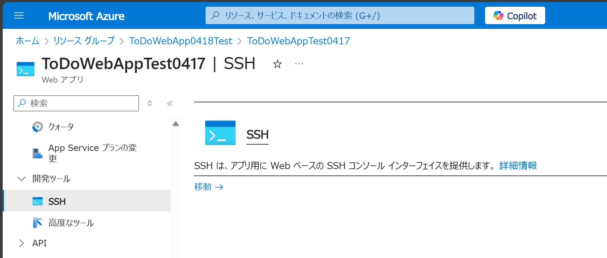
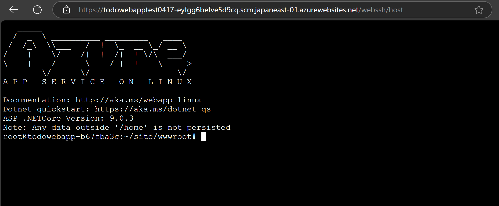
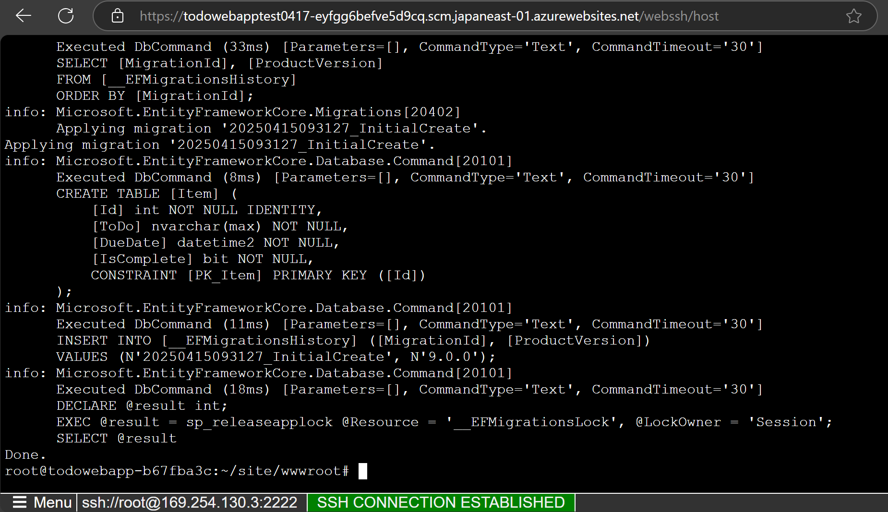

# Azure App Service & SQL Database ハンズオン

⏲️ _Est. time to complete: 60 - 90 min._ ⏲️

## 目次

- [Azure App Service \& SQL Database ハンズオン](#azure-app-service--sql-database-ハンズオン)
  - [目次](#目次)
  - [本ハンズオンで学べること 🎯](#本ハンズオンで学べること-)
  - [アプリケーション概要](#アプリケーション概要)
  - [事前準備](#事前準備)
  - [Web アプリとデータベースの作成](#web-アプリとデータベースの作成)
  - [GitHub リポジトリの作成](#github-リポジトリの作成)
  - [SQL Database 接続文字列の確認と更新](#sql-database-接続文字列の確認と更新)
  - [アプリのビルドとデプロイ](#アプリのビルドとデプロイ)
  - [デプロイ スロットを利用したアプリケーションの更新](#デプロイ-スロットを利用したアプリケーションの更新)
    - [デプロイ スロットの作成](#デプロイ-スロットの作成)
    - [GitHub Codespaces を使ったアプリケーションの更新](#github-codespaces-を使ったアプリケーションの更新)
    - [プルリクエストの作成とマージ](#プルリクエストの作成とマージ)
    - [デプロイ スロットの切り替え (スワップ)](#デプロイ-スロットの切り替え-スワップ)
  - [まとめ](#まとめ)
  - [参考資料](#参考資料)

## 本ハンズオンで学べること 🎯

- Azure App Service と SQL Database の概要
  - Azure App Service の作成
  - SQL Database の作成
  - SQL Database の接続文字列の確認と更新
  - Azure App Service へのデプロイ
  - デプロイ スロットの作成
  - デプロイ スロットの切り替え
  - GitHub Actions を使用した CI/CD の実行
  - GitHub Codespaces を使用したアプリケーションの更新
  - GitHub Pull Request の作成とマージ
- GitHub の概要
  - GitHub Actions の概要
  - 変更を Commit して Push する方法
  - Pull Request を作成してマージする方法
  - GitHub Codespaces の概要
- .NET と ASP.NET Core MVC の概要
  - ASP.NET Core MVC アプリケーションの概要
  - Entity Framework Core を使用した SQL Database への接続

## アプリケーション概要

このハンズオンで使用する MyToDoAppSQL は、ASP.NET Core 9.0 と Microsoft SQL Server（Entity Framework Core）を用いたシンプルな ToDo 管理 Webアプリケーションです。タスク（ToDo）の登録・編集・削除・詳細表示が可能です。詳細は、GitHub Copilot で生成した [こちら](../README.md) のソフトウェア内部仕様書をご覧ください。

## 事前準備
- GitHub アカウントの作成
  - GitHub のアカウントをお持ちでない場合は、[https://github.com/](https://github.com/) からアカウントを新規作成してください。
- (任意) GitHub Copilot の準備
  - GitHub Copilot を使用する場合は、[こちら](https://github.com/features/copilot) から GitHub Copilot を有効化してください。
- Microsoft Azure サブスクリプションの準備
  - Microsoft Azure のアカウントをお持ちでない場合は、[こちら](https://azure.microsoft.com/ja-jp/free/) からアカウントを新規作成してください。
  - Azure のアカウントをお持ちの方は、[こちら](https://portal.azure.com/) から Azure ポータルにサインインして、トップページのダッシュボードが表示されることを確認してください。
  - 管理者側で用意された Azure サブスクリプションを使用する場合は、Azure ポータルにサインインして、管理者側で事前に払い出された **共同作成者ロールが割り当てられているリソースグループ** が用意されていることを確認してください。

(任意) 本ハンズオンは、Web ブラウザのみで完結するように設計されていますが、Visual Studio 2022 を使用してローカル環境での開発を行うことも可能です。必要に応じて、以下の手順で Visual Studio 2022、Git、.NET のインストールや準備をおこなってください。
- Visual Studio 2022 のインストール
  - Visual Studio 2022 をお持ちでない場合は、[こちら](https://visualstudio.microsoft.com/ja/downloads/) から Visual Studio 2022 をダウンロードしてインストールしてください。
  - インストール時に、`ASP.NET と Web 開発` と `Azure の開発` のワークロードを選択してください。
  - また、`個別のコンポーネント` タブから `Git for Windows` を選択してください。
  - インストール後、Visual Studio 2022 を起動して、`MS アカウント` または `GitHub` アカウントでサインインして初期画面が表示されることを確認してください。
- Git の確認
  - Visual Studio 2022 と共に Git もインストールされます。Windows メニューから `コマンド プロンプト` を開き `git` と入力して Git コマンドが実行できることを確認してください。
  - もし、Git が実行できない場合は、[こちら](https://gitforwindows.org/) から **Git for Windows** をダウンロードして、個別にセットアップしてください。
- .NET 9 SDK の確認
  - Visual Studio 2022 と共に .NET SDK もインストールされます。Windows メニューから `コマンド プロンプト` を開き `dotnet` と入力して .NET コマンドが実行できることを確認してください。
  - もし、`dotnet` コマンドが実行出来ない場合は、[こちら](https://dotnet.microsoft.com/download/dotnet) から **.NET 9 SDK** をダウンロードしてインストールしてください。
- Entity Framework Core ツールのインストール
  - Windows メニューから `コマンド プロンプト` を開き、以下のコマンドを実行して Entity Framework Core ツールをインストールしてください。
    ```bash
    dotnet tool install --global dotnet-ef
    ```

## Web アプリとデータベースの作成
1. Azure ポータルにサインインして、ページ上部にある検索バーに `Webアプリとデータベース` と入力します。
2. [Marketplace] 見出しの下にある `Web アプリとデータベース` を選択して、`Web アプリとデータベースの作成` ページに移動します。

3. `Web アプリとデータベースの作成` ページで、以下の情報を入力してください。
   - サブスクリプション: 使用する Azure サブスクリプション名
   - リソースグループ: 事前に用意された共同作成者ロールが割り当てられているリソースグループを選択するか、[新規作成] から新しく作成するリソースグループ名を入力
   - リージョン: `Japan East` (任意のリージョン)
   - 名前: `mytodowebapp` (任意の名前)
   - ランタイムスタック: `.NET 9 (STS)`
   - エンジン: `SQLAzure (推奨)`
   - サーバー名: `mytodowebapp-server` (任意の名前)
   - データベース名: `mytodowebapp-database` (任意の名前)
   - Azure Cache for Redis を追加しますか?: `いいえ`
   - ホスティング プラン: `Basic - 趣味や研究目的`

1. 上記の情報を入力したら、`確認および作成` をクリックしてください。
2. `確認および作成` ページでエラーがなければ、`作成` をクリックしてください。
3. デプロイメントが完了するまで数分かかります。デプロイメントが完了したら、`リソースに移動` ボタンをクリックしてください。
4. 作成した Web アプリの概要ページが表示されます。
5. [規定のドメイン] にある URL をクリックして、Web アプリが正常に作成されたことを確認してください。

## GitHub リポジトリの作成
1. GitHub にサインインして、次のサンプル リポジトリを表示します。
   - [https://github.com/chack411/MyToDoAppSQL](https://github.com/chack411/MyToDoAppSQL)
2. 右上の `Use this template` ボタンをクリックして、`Create a new repository` をクリックします。
3. `Owner` で自分のアカウント名を選び、`Repository name` に `MyToDoAppSQL` などの任意の名前を入力します。
4. リポジトリの公開設定を `Public` (または `Private`) に設定します。
5. `Create repository` をクリックします。
6. ご自身の GitHub アカウントのリポジトリに、指定した名前でリポジトリが作成されたことを確認します。

## SQL Database 接続文字列の確認と更新
1. Azure ポータルにサインインして、作成した Web アプリの概要ページを開きます。
2. 左側のメニューから `設定` - `環境変数` を選択して、`接続文字列` タブを選択します。`AZURE_SQL_CONNECTIONSTRING` という名前の接続文字列があることを確認します。
3. この接続文字列は、Web アプリを作成したときに自動生成された、SQL データベースへの接続情報です。この文字列をクリックして、`接続文字列の追加/編集` ページを開き、名前を `MyToDoAppSQLContext` に変更して、`適用` ボタンをクリックします。この接続文字列名 `MyToDoAppSQLContext` は、ソースコードで指定されている名前になります。
4. `接続文字列` の一覧ページに戻りますので、名前が変更されていることを確認し、もう一度ページ下部にある `適用` ボタンをクリックして変更を保存します。

## アプリのビルドとデプロイ
1. Web アプリの左側のメニューから `デプロイ` - `デプロイ センター` を選択します。
2. `デプロイ センター` ページの [ソース] で、`GitHub` を選択し、GitHub にサインインします。
3. `GitHub` のリポジトリを選択します。
   - 組織: `ご自身の GitHub アカウント名`
   - Repository: `MyToDoAppSQL` (作成したリポジトリ名)
   - Branch: `main`
4. `認証タイプ` で `基本認証` を選択します。
   - Azure サブスクリプションの所有者や共同作成者権限を持っている場合は、`ユーザー割り当て ID` を選択することで、セキュアな認証を行うこともできます。
5.  `デプロイ センター` ページ上部の `保存` ボタンをクリックして、設定を保存します。
6.  GitHub のリポジトリに戻り、Actions タブをクリックして、`Azure App Service` のデプロイメントが開始されていることを確認します。
7.  デプロイメントが完了したら、Azure ポータルに戻り、作成した Web アプリの概要ページを開きます。
8.  [規定のドメイン] にある URL をクリックして、Web アプリを表示します。初回の表示には数分かかります。また、初期画面で `Error` が表示されます。
9.  このエラーは、**SQL Database にデータベースが作成されていない** ために発生しています。次の手順で、GitHub Actions のワークフロー ファイル (YAML ファイル) を更新して、データベースの初期化コマンドを実行して SQL Database にデータベースを作成します。
10. GitHub のリポジトリに戻り、`Actions` タブをクリックして、`Add or update the Azure App Service build and deployment workflow config` のワークフローを選択します。
11. `main_<Azureで作成したWebアプリ名>.yml` をクリックして、ワークフロー ファイルを開きます。
12. このファイルは、GitHub Actions のワークフロー ファイルで、Azure App Service にデプロイするための設定が記述されています。ワークフロー ファイルの上部右側にある `鉛筆マーク` ボタンをクリックして、ワークフロー ファイルの編集画面に移ります。
13. 32行目の `name: Upload artifact for deployment job` の前に、以下の記述を追加してください。
    ```yaml
          - name: Database migration
            run: |
              dotnet tool install -g dotnet-ef
              dotnet ef migrations bundle --runtime linux-x64 -p MyToDoAppSQL -o ${{env.DOTNET_ROOT}}/myapp/migrationsbundle
    ```
    

14. 追加した内容を確認して問題なければ、`Commit changes` ボタンをクリックして、変更をコミットします。この際 `Commit directly to hte main branch` が選択されていることを確認してください。
14. 再び、GitHub のリポジトリに戻り、`Actions` タブをクリックして、新しいワークフローが開始されていることを確認します。
15. ワークフローの実行が完了したら、Azure ポータルに戻り、作成した Web アプリの概要ページを開きます。
16. ページ左側のメニューから `開発ツール` - `SSH` を選択して、`移動 →` ボタンをクリックします。
17. `SSH` ページが表示されます。
18. 次のコマンドを入力して `/home/site/wwwroot` フォルダに移動します。
    ```bash
    cd /home/site/wwwroot
    ```
19. `wwwroot` フォルダに移動したら、`ls` コマンドを入力して、デプロイした Web アプリのファイル群があることを確認します。
    ```bash
    ls
    ```
20. `migrationsbundle` コマンドを実行します。   
    ```bash
    migrationsbundle
    ```
21. 上記のコマンドは、アプリケーションのデータベースのスキーマに基づいて、SQL データベースの初期化を行うコマンドです。実行後、以下のようなメッセージが表示され、初期状態の SQL データベースが作成されます。
22. 再び Azure ポータルに戻り、作成した Web アプリの概要ページを開きます。[規定のドメイン] にある URL をクリックして、Web アプリがエラーなく表示されることを確認します。
23. `+ Create New` ボタンをクリックして、任意のタスクを追加して動作を確認します。


## デプロイ スロットを利用したアプリケーションの更新

ここまでの手順で、Azure App Service と SQL データベースを使用した .NET アプリケーションのデプロイが完了しました。次に、デプロイ スロットを利用して、アプリケーションの更新を行います。
デプロイ スロットを使用すると、アプリケーションの新しいバージョンを開発/テスト環境で確認してから、本番環境に切り替えることができます。これにより、アプリケーションの可用性を高めることができます。

### デプロイ スロットの作成
1. Azure ポータルにサインインして、作成した Web アプリの概要ページを開きます。
2. 前の演習で作成した Web アプリの App Service のプランは `Basic B1` です。デプロイ スロットを使用するには、`Standard` プラン以上にアップグレードする必要があります。ページ左側のメニューから `設定` - `スケールアップ (App Service のプラン` を選択して、表示されるプランからデプロイ スロットが使用できて最もコストが安い `Premium v3 P0V3` を選択して、`選択` ボタンをクリックします。
3. 続いて、`アップグレード` ボタンをクリックして、プランの変更を適用します。
4. ページ左側のメニューから `デプロイ` - `デプロイ スロット` を選択し、表示されたページで `Add slot` をクリックします。
5. `Add Slot` ページが表示されますので、次の値を入力/選択して `Add` ボタンをクリックします。
   - `Name` : `staging`
   - `Clone settings from:` : `<Web アプリ名>`
    
6. デプロイ スロットの作成が完了すると、スロットの一覧が表示され、元の `PRODUCTION` スロットに加えて、新たに `staging` スロットが作成されたことが確認できます。
7. `staging` スロットをクリックして、スロットの概要ページを開きます。
8. [規定のドメイン] にある URL をクリックして、`staging` スロットの Web アプリが表示されることを確認します。
9. `staging` スロットの Web アプリへのデプロイを GitHub Actions で行うために、`staging` スロットの発行プロファイルをダウンロードします。`staging` スロットの概要ページで、`発行プロファイルのダウンロード` をクリックして発行プロファイルをダウンロードします。
10. ダウンロードした発行プロファイルをメモ帳などのテキストエディターで開き、すべてを選択 (`Ctrl+A`) して文字列をコピー (`Ctrl+C`) します。
11. GitHub のリポジトリに戻り、`Settings` タブをクリックして、左側のメニューから `Secrets and variables` - `Actions` を選択します。
12. `Repository secrets` にある `AZUREAPPSERVICE_PUBLISHPROFILE_XXXXXXXXXXXXXX` の [鉛筆アイコン] をクリックして、シークレットの編集ページ `Actions secrets / Update secret` を開き、`Value` にコピーした発行プロファイルの文字列をペーストします。
13. `Update secret` ボタンをクリックして、シークレットを更新します。

### GitHub Codespaces を使ったアプリケーションの更新
1. GitHub のリポジトリに戻り、`Code` タブをクリックして、リポジトリのトップページを開きます。左側に [main] と表示されているボタンをクリックして、[Find or create a branch] と書かれているテキストボックスに `feature1` と入力します。続いて `Create branch feature1 from main` をクリックして、作業用の新しいブランチを作成します。
2. 新しいブランチが作成されたら、緑色の `Code` ボタンをクリックして表示されるポップアップウィンドウで、`Codespaces` タブをクリックし、`Create codespace on feature1` をクリックして、Codespace を開きます。
4. Web ブラウザ上に Visual Studio Code と同じ UI で、コードエディタが表示されます。
5. エディタウィンドウ左下に表示されているブランチ名が `feature1` になっていることを確認します。
6. `.github/workflows` フォルダを開き、`main_<Azureで作成したWebアプリ名>.yml` をクリックして、ワークフロー ファイルを開き、61行目の `slot-name: Production` を `slot-name: staging` に変更します。ここで指定した名前のデプロイ スロットに Web アプリがデプロイされるようになります。
7. 続いて、`MyToDoAppSQL/wwwroot/css/site.css` をクリックして CSS ファイルを開き、20 行目の `body` 要素に、以下のスタイル属性を追加します。
    ```css
    body {
        background-color: lightpink;
        ...
    }
    ```
    
8. 変更が完了したら、左側のメニューから `ソース管理` アイコンをクリックして、変更内容を確認します。問題なければ、[コミットメッセージ] を入力してから `コミット` ボタンをクリックします。
9. 次のメッセージが表示されたら、`はい` ボタンをクリックします。
10. ソース管理の `変更の同期` ボタンをクリックして、変更をリモートの `feature1` ブランチにプッシュします。
11. 次のメッセージが表示されたら、`OK` ボタンをクリックします。
12. これで、`feature1` ブランチに変更がプッシュされました。

### プルリクエストの作成とマージ
1. GitHub のリポジトリに戻ると、`Compare & pull request` ボタンが表示されているので、クリックします。
2. [feature1] ブランチから [main] ブランチへのプルリクエストであることと、タイトルが入力されていることを確認します。合わせて、[Add a description] に変更内容を記入します。
3. [Add a description] には、GitHub Copilot の Summary 機能を使用して、変更内容を記入することもできます。
4. `Create pull request` ボタンをクリックして、プルリクエストを作成します。
5. 作成されたプルリクエストを確認します。
6. `Files changed` タブをクリックすると、変更内容を確認することができます。
7. 変更内容に問題がなければ、`Conversation` タブに戻り、`Merge pull request` ボタンをクリックしてプルリクエストをマージします。
8. `Confirm merge` ボタンをクリックして、マージを確定します。
9. GitHub のリポジトリに戻り、`Actions` タブをクリックして、新しいワークフローがマージをトリガーに開始されていることを確認します。
10. ワークフローの実行が完了したら、Azure ポータルに戻り、作成した Web アプリの [デプロイ] - [デプロイ スロット] から `staging` の Web アプリの概要ページを開きます。[規定のドメイン] にある URL をクリックして、Web アプリがエラーなく表示され、背景の配色が変更されていることを確認します。

### デプロイ スロットの切り替え (スワップ)
1. Azure ポータルにサインインして、作成した Web アプリの概要ページを開きます。
2. ページ左側のメニューから `デプロイ` - `デプロイ スロット` を選択し、表示されたページで `Swap` をクリックします。
3. `Swap` ページが表示されるので、`Source` と `Target` を確認して、`Start Swap` ボタンをクリックします。
4. デプロイ スロットのスワップが完了すると、スロットの一覧が表示され、元の `PRODUCTION` スロットと `staging` スロットが入れ替わります。
5. `PRODUCTION` として最初に作成した Web アプリの概要ページを開き、[規定のドメイン] にある URL をクリックして Web アプリを表示します。スワップ前に `staging` スロットにデプロイした背景の配色を変更した Web アプリが `PRODUCTION` 環境に表示されることを確認します。

## まとめ

以上で、Azure App Service と SQL データベースを使用した .NET アプリケーションのデプロイが完了しました。GitHub Actions を使用して、アプリケーションのビルドとデプロイを自動化する方法についても学びました。
今後は、GitHub Copilot を使用して、アプリケーションの機能を追加したり、デザインを変更したりすることができます。また、Azure App Service のデプロイ スロットを利用して、アプリケーションの更新を行うこともできます。これにより、アプリケーションの可用性を高めることができます。さらには、Azure の他のサービスを組み合わせて、より高度なアプリケーションを構築することも可能です。例えば、Azure Functions を使用してサーバーレスアーキテクチャを実現したり、Azure Cosmos DB を使用して分散データベースを構築したりすることができます。
ぜひ、Azure のサービスを活用して、より高度なアプリケーションを構築してみてください。

おつかれさまでした！

## 参考資料
- [Azure App Service](https://azure.microsoft.com/ja-jp/services/app-service/)
- [Azure SQL Database](https://azure.microsoft.com/ja-jp/services/sql-database/)
